#BASE
##easy？
###50
>密文mzdvezc是用仿射函数y=5x+12加密得到的，试对其解密。

直接一个Python解决问题

    #!/usr/bin/env python
    # -*- coding: utf-8 -*-
    __Url__ = 'Http://www.purpleroc.com'
    __author__ = 'Tracy_梓朋'
    def affine(a, b):
        pwd_dic = {}
        for i in range(26):
            pwd_dic[chr(((a*i+b)%26)+97)] = chr(i+97)
        return pwd_dic

    if __name__ == '__main__':
        pwd_dic = {}
        pwd = "mzdvezc"
        plain = []
        pwd_dic = affine(5, 12)
        for i in pwd:
            plain.append(pwd_dic[i])
        print "You Flag is: " + "".join(plain)

>You Flag is: anthony

##神秘纸条
###50
>pHBP018DCCh/KTe6Psz1/g==
Lo1tv5ESqHnUzrFUA9EKeA==
pHV9dBn/O0jpLpBZbw51SA==
Ypm6LL2WYaXjhytxVSHNag==
mpftptifXJ6EVgRooGeXBw==

扔到cmd5里面解一下得到 The death god only eat
把这句话Google一下 得到 The death god only eat apples
>flag:apples

##恶作剧or机密？
###100
>小锐最近get一份公司的文档，听说里面有很多重要的内部资料，可惜的是，他不会破解文档，你能帮帮他吗？
见附件：企业年度财政报表.docx
hint1: 加密密码只有4位

很无脑的一道题,跑密码,而且是很无脑的一个密码:hj7k
打开一串base64解密一下就好了

    import base64
    print "Your flag is:" + base64.b64decode(base64.b64decode("WkhWaGJtY3lNREUxWkhWaGJtZGtZUW89Cg=="))

>Your flag is:duang2015duangda

##Decrypt
###150

>密文：
22,09,00,12,03,01,10,03,04,08,01,17
（wjamdbkdeibr）

>使用的矩阵是
1 2 3
4 5 6
7 8 10

>请对密文解密.

一个[希尔密码](http://baike.baidu.com/link?url=mstDgs2ok15By1mFmO4Jn1MWC4-pdldR5BwtL2pmzJz80KLo7CJ9xUsahIcLC3kksq_nX5qT_pOXn2x3p4qLf_/ "Title") 老老实实写个Python解密
    
    #!/usr/bin/env python
    # -*- coding: utf-8 -*-
    __Url__ = 'Http://www.purpleroc.com'
    __author__ = 'Tracy_梓朋'

    from numpy import *

    Dic = {chr(i+97):i for i in range(26)}

    def decode(pwd, org):
        temp = []
        result = []
        while True:
            if len(pwd) % 3 != 0:
                pwd.append(pwd[-1])
            else:
                break

        for i in pwd:
            temp.append(Dic.get(i))

        temp = array(temp)
        temp = temp.reshape(len(pwd)/3, 3)
        #print temp
        #print org
        xx = matrix(temp)*org

        for j in range(len(pwd)/3):
            for i in range(3):
                if (int(xx[j, i]) >= 26):
                    result.append(chr(xx[j, i] % 26 + 97))
                    #print xx[j, i] % 26
                else:
                    #print xx[j, i]
                    result.append(chr(xx[j, i] + 97))

        return result

    def get_vmatrix(org):
        org_adjoin = org.I*linalg.det(org)
        print org_adjoin
        org_det = int(str(abs(linalg.det(org))).split('.')[0])
        print org_det
        for i in range(1, 26):
            if i * org_det % 26 == 1:
                break

        org_mod = -org_adjoin * i % 26

        org_mod = matrix(org_mod)
        temp = []
        for i in range(org_mod.shape[0]):
            for j in range(org_mod.shape[1]):
                temp.append(int(str(org_mod[i, j]).split('.')[0]))
        org_final = matrix(temp).reshape(org_mod.shape[0], org_mod.shape[1])
        #print org_final
        return org_final

    if __name__ == '__main__':
        ''' for test
        pwd = list("act")
        org = matrix(array([[6, 24, 1], [13 , 16, 10], [20, 17, 15]]))
        result = decode(pwd, org)
        print "".join(result)
        deorg = matrix(array([[8, 5, 10], [21 , 8, 21], [21, 12, 8]]))
        result = decode(result, deorg)
        print "".join(result)
        '''
        pwd = "wjamdbkdeibr"
        pwd = list(pwd)
        org = matrix(array([[1,2,3],[4,5,6],[7,8,10]]))
        org_vm = get_vmatrix(org)
        print org_vm
        print "Your flag is :" + "".join(decode(pwd, org_vm))

>Your flag is :overthehillx

##蛛丝马迹
###150

>小野入侵了一个台服务器，发现一个保存重要密码的程序代码，小野又发现了一些蛛丝马迹，他能破解么？

附件：
公司内部密钥程序.txt
>0xBE,  0x2A,  0x28,  0x48,  0x7A,  0x5C,  0x2A,  0x21,  0xCB,  0x93,  0x0D,  0x2A,  0x70,        
0x36,  0xD3,  0x4E,  0xC9,  0xB6,  0xCF,  0x3C,  0xB6,  0x71,  0x99,  0xF5,  0x46,  0x69,  0xA1,        
0x24,  0xF9,  0x71,  0x70,  0x11,  0x2A,  0x37,  0x31,  0x27,  0x30,  0x16,  0x71,  0x90,  0x26,        
0xC9,  0x18,  0x72,  0xC9,  0x09,  0x4E,  0xC9,  0x0B,  0x5E,  0xC9,  0x4B,  0xC9,  0x2B,  0x4A,        
0xEF,  0x7F,  0x28,  0x48,  0x7A,  0x5C,  0x37,  0x47,  0xD7,  0xBD,  0x15,  0xBA,  0xD7,  0x22,        
0xC9,  0x07,  0x7E,  0xC9,  0x0E,  0x47,  0x3A,  0x41,  0x8F,  0xC9,  0x1B,  0x62,  0x41,  0x9F,        
0x71,  0xBD,  0x05,  0xC9,  0x76,  0xF9,  0x41,  0xB7,  0xDB,  0x4D,  0xFC,  0x44,  0x78,  0x86,        
0x36,  0x4A,  0x83,  0x88,  0x45,  0x41,  0x92,  0x04,  0xA9,  0xB3,  0x79,  0x16,  0x66,  0x5E,        
0x37,  0xA6,  0xC9,  0x1B,  0x66,  0x41,  0x9F,  0x24,  0xC9,  0x7E,  0x39,  0xC9,  0x1B,  0x5E,        
0x41,  0x9F,  0x41,  0x6E,  0xF9,  0xD7,  0x1D,  0xE9,  0x15,  0x23,  0x7F,  0x28,  0x48,  0x7A,        
0x5C,  0x37,  0xEB,  0x71,  0x99,  0x11,  0x2A,  0x35,  0x34,  0x36,  0x64,  0x2A,  0x14,  0x29,        
0x68,  0x7A,  0xC9,  0x86,  0x11,  0x12,  0x12,  0x11,  0xBD,  0x15,  0xBE,  0x11,  0xBD,  0x15,        
0xBA,  0xD2,  0xD2,  0xD2,  0xD2      

企业加密方式.txt
公司内部所有的加密形式均为异或加密，且只使用异或加密，加密KEY：0x42
请牢记，保密！

异或完了后,把它放到一个exe的入口点,然后,直接运行exe就可以弹出flag.

    #!/usr/bin/env python
    # -*- coding: utf-8 -*-
    __Url__ = 'Http://www.purpleroc.com'
    __author__ = 'Tracy_梓朋'
    pwd = "BE,  0x2A,  0x28,  0x48,  0x7A,  0x5C,  0x2A,  0x21,  0xCB,  0x93,  0x0D,  0x2A,  \
        0x70,  0x36,  0xD3,  0x4E,  0xC9,  0xB6,  0xCF,  0x3C,  0xB6,  0x71,  0x99,  0xF5,  0x46,  \
        0x69,  0xA1,  0x24,  0xF9,  0x71,  0x70,  0x11,  0x2A,  0x37,  0x31,  0x27,  0x30,  0x16,  \
        0x71,  0x90,  0x26,  0xC9,  0x18,  0x72,  0xC9,  0x09,  0x4E,  0xC9,  0x0B,  0x5E,  0xC9,  \
        0x4B,  0xC9,  0x2B,  0x4A,  0xEF,  0x7F,  0x28,  0x48,  0x7A,  0x5C,  0x37,  0x47,  0xD7,  \
        0xBD,  0x15,  0xBA,  0xD7,  0x22,  0xC9,  0x07,  0x7E,  0xC9,  0x0E,  0x47,  0x3A,  0x41,  \
        0x8F,  0xC9,  0x1B,  0x62,  0x41,  0x9F,  0x71,  0xBD,  0x05,  0xC9,  0x76,  0xF9,  0x41,  \
        0xB7,  0xDB,  0x4D,  0xFC,  0x44,  0x78,  0x86,  0x36,  0x4A,  0x83,  0x88,  0x45,  0x41,  \
        0x92,  0x04,  0xA9,  0xB3,  0x79,  0x16,  0x66,  0x5E,  0x37,  0xA6,  0xC9,  0x1B,  0x66,  \
        0x41,  0x9F,  0x24,  0xC9,  0x7E,  0x39,  0xC9,  0x1B,  0x5E,  0x41,  0x9F,  0x41,  0x6E,  \
        0xF9,  0xD7,  0x1D,  0xE9,  0x15,  0x23,  0x7F,  0x28,  0x48,  0x7A,  0x5C,  0x37,  0xEB,  \
        0x71,  0x99,  0x11,  0x2A,  0x35,  0x34,  0x36,  0x64,  0x2A,  0x14,  0x29,  0x68,  0x7A,  \
        0xC9,  0x86,  0x11,  0x12,  0x12,  0x11,  0xBD,  0x15,  0xBE,  0x11,  0xBD,  0x15,  0xBA,  \
        0xD2,  0xD2,  0xD2,  0xD2"
    key = "0x42"

    if __name__ == '__main__':
        cipher = pwd.split(',  0x')
        #print "".join(cipher)
        plain = []
        temp = []
        for i in cipher:
            open("../../DATA/BASIC05/basic5.bin","ab").write(chr(int(i, 16) ^ int(key, 16)))

        #print "Flag is: Vk*8wvt&"
        
>Flag is Vk*8wvt&

#WEB
##What should you do now?
###200

>以前考试的时候，发现越是描述的比较简单的题目，往往越复杂。但是这道题可不一样偶，快来试试吧！
>http://script.iscc.org.cn/script01/

查看一下源码 发现只要遍历一下4位数数字就可以了
附上遍历的js

    <html>
    <!--  1236 : Key:YeahYourMind
        Author: Tracy_梓朋
        Url : www.purpleroc.com
    -->
    <head>
    
    </head>
    <body>
    
Click to get Flag!            
    

     

     <input type=text name=pass> <input type=submit onclick=b()>               
 </body> </html>
>Key:YeahYourMind

##How？
###250

>http://script.iscc.org.cn/script02/login.php

这应该不是出题者的初衷.随意填一个密码后,提示Your password for guest is wrong.      
然后,response head如下:

    Connection keep-alive
    Content-Length 34
    Content-Type text/html; charset=UTF-8
    Date Tue, 05 May 2015 15:47:31 GMT
    Server Apache
    Via 1.1 www.isclab.org (squid)
    X-Cache MISS from www.isclab.org
    X-Powered-By PHP/5.3.3
    goder Y618
    sql "select * from admin_password where password='".md5($password,true)."'"
    
Google一下md5($password,true),有一些参考资料      
[http://cvk.posthaven.com/sql-injection-with-raw-md5-hashes](http://cvk.posthaven.com/sql-injection-with-raw-md5-hashes)      
[http://auntitled.blogspot.jp/2010/09/leet-more-ctf-2010-write-up-oh-dears.html](http://auntitled.blogspot.jp/2010/09/leet-more-ctf-2010-write-up-oh-dears.html)      
[http://pastebin.com/w5E54PNz](http://pastebin.com/w5E54PNz)      
[http://pastebin.com/2xMG9rKi](http://pastebin.com/2xMG9rKi)      
[http://pastebin.com/ThxBESPs](http://pastebin.com/ThxBESPs)      

然后,知道是md5 injection with raw md5 hashs.
不过似乎服务端是硬编码的,必须的猜出出题人给的那字符才行~~~
> 输入密码 ffifdyop 
>You got it! flag:{45dcbc39e5596ffbb0d09dd3e2bde0fa}

##Gift
###350

>上次的用完了，我生日又快到了，再给我点流量当生日礼物吧。
>http://script.iscc.org.cn/script03/

看上去像去年的神兽，可其实不是，也不知道是要考啥，有个提示转流量下限是1G。
所以让结果等于NAN，无穷小就行了

输入：99e9999-99e1111      得到flag：
>    你打算送我NANMB流量。
    谢谢你给我这么多流量，flag给你了。
    flag:{68d43d512ca7214e05acc96cc100515e}

##非常道
###350

>我们经常把WEB服务搭建在linux服务器上，可是王老师告诉我们要逆其道而行之。
http://script.iscc.org.cn/script04

正常访问返回：
Let's capture flag in this level.

响应头里看到一个
>hint   cmd

发现不管是post cmd还是get cmd都返回Do you wanna something else?
猜测他的cmd是REQUEST接受的 所以尝试了下Cookie提交
>cmd=ls

返回
>98ed9baeb613a0f5 ed9b.php index.php

然后，改成
>cat 98ed9baeb613a0f5
>flag:{559baa94ce76a540e62f86a77bbe4f6c} 

#MISC

##Godlike
###300

>天空中没有留下鸟的痕迹,但我已飞过。 但是，请站在上帝视角看问题！

挺好玩的一道题吧.拿过来直接binwalk,发现挺多东西,好多dll,还有zip.      
然后foremost提取得到文件.发现有个加密的zip.      
还以为是伪加密,尝试了下,发现不是的.      
然后就

    strings misc300.pcap | grep password
    strings misc300.pcap | grep pwd
    strings misc300.pcap | grep zip
    
尝试了下.      
发现,zip是上传到网站的,然后还有个

    action=shell&command=unzip+-P+%22havefun%22+.%2Fhehe.zip&submit=Execute@

然后,就得到了解压密码.havefun      
打开压缩包,得到hh.txt.      
>flag{ce8c136df237e86bb7a553347f}

##道之道
###300

>天下万物生于有，有生于无，有序常蕴于无序之中。

这题,我也不知道要怎么描述了,额,刚开始看到rot13哈以为要全部rot13一次呢,然后就用vi给图片rot13加了个密.      
再打开,发现确实有些地方变了,然后就开始纠结非字母段该如何~      
好一会儿后,无果.      
然后用stegsolve看了下data提取.发现了PK,哎╮(╯▽╰)╭卧槽.      
然后提出来后总觉得不对.就手动修zip,还不对.然后就看了下其他颜色通道.      
然后发现,其他里面也有数据.把rgb1全部提取出来差不多刚好是个zip了.然后,还是不太对.      
看各个单颜色通道.把有数据的提取出来,人工组合.....      

后~~~~尼玛,还是有点问题.然后脑洞打开,将所有提取到的文件内容依次亦或.终于看起来正常了点.      
但还是解密失败.      

对照着zip文件格式,看看哪里不对,最后定位到data段.86-118这一段,三个数据块.      
然后各种亦或组合.........无果.      
再然后,要学弟提取一份.      
对照看,发现,在这之前还有一段是被我亦或过的.....艹啊.      
然后~~~用后面注释跟的内容rot13后作为密码.得到flag.      

后来发现,其实就是每一行一种颜色,进行对比,然后置位010101得到一个zip.      
py如下:      
comp函数由J0ker指点并提供      

    #!/usr/bin/env python
    # -*- coding: utf-8 -*-
    __Url__ = 'Http://www.purpleroc.com'
    __author__ = 'Tracy_梓朋'
    
    import Image
    import zipfile

    def rot13(s, OffSet=13):
        def encodeCh(ch):
            f = lambda x: chr((ord(ch)-x+OffSet) % 26 + x)
            return f(97) if ch.islower() else (f(65) if ch.isupper() else ch)
        return ''.join(encodeCh(c) for c in s)

    def comp(base,curpix):
        a = 0
        bv = 0
        for i in range(3):
            if(base[i] != curpix[i]):
                a = i
                if(curpix[i]>base[i]):
                    bv = base[i]
                else:
                    bv = curpix[i]
        return (a,bv)

    if __name__ == '__main__':
        img = Image.open('../../DATA/MISC03/isccfinal.bmp')
        pix = img.load()
        w,h = img.size
        result = ""
        for i in range(h):
            base = pix[0,i]
            cmpr = ()
            for j in range(w-1):
                if (base != pix[j+1,i]):
                    cmpr = comp(base,pix[j+1,i])
            for k in range(w):
                if(cmpr == ()):
                    result += '0' * w
                    break
                else:
                    result += str(pix[k,i][cmpr[0]]-cmpr[1])
        req = []
        for i in range(0, len(result), 8):
            req.append(chr(int(result[i: i + 8],2)))
        pwd = "".join(req)[-16:]
        pwd = rot13(pwd)
        #print pwd
        open("../../DATA/MISC03/result.zip", "wb").write("".join(req))
        zip = zipfile.ZipFile("../../DATA/MISC03/result.zip", "r")
        zip.extract("flag.txt", "../../DATA/MISC03/", pwd)
        print open("../../DATA/MISC03/flag.txt").read()

>flag:{40a4156965b782efb4f574c5d0cf219a}

##看序列，找规律。
###350

>等差数列？NO！等比数列？NO！

看了看,一个exe,ffi看到是vc的程序.虚拟机里运行提示Java 运行环境没找到.      
然后就主机上IDA\OD同时跟上,本来想逆一逆的,无奈找不到断点,F7 F8大概看了下,Java的,不熟,遂放弃这一想法.      
就想着用做android的思路去解决他.      

ESC+Shift+Ctrl调出任务管理器.找到ISCC.EXE.转存之.      
然后在里面搜了下界面上的几个字符,发现有的.还是unicode形式.      
然后就搜了下flag.ascii的unicode的都有.      
F3几次之后,看到FLAG.      

    strings dump.dmp | grep flag

后来想了想,毕竟不是re啊.是misc,对,是misc....╮(╯▽╰)      
> !\^_^! You got it! flag:{99922ad4c295f66fcdc2ebc6cfb91be6}

##细节决定成败
###350
>What's this?

先用修复一下图片吧,改一下头部得到一个PNG,然后binwalk看了下:

    root@tracy:~/Desktop# binwalk iscc.png

    DECIMAL       HEXADECIMAL     DESCRIPTION
    --------------------------------------------------------------------------------
    0             0x0             PNG image, 1440 x 810, 8-bit/color RGBA, non-interlaced
    41            0x29            Zlib compressed data, compressed, uncompressed size >= 163840
    1988164       0x1E5644        Zlib compressed data, default compression, uncompressed size >= 31

有两端被压缩的.取后面那段解压得到flag.      
附上Python

    #!/usr/bin/env python
    # -*- coding: utf-8 -*-
    __Url__ = 'Http://www.purpleroc.com'
    __author__ = 'Tracy_梓朋'
   
    from zlib import *

    if __name__ == '__main__':
        data = open("../../DATA/MISC05/iscc.png", "rb").read()[0x1E5644:]
        print decompress(data)

>flag{PNG_IDAT_LZ777_justforfun}

#RE
##heeeeeeeelp
###200

>楼主得到一个受注册秘钥限制的软件，通过多方努力后终于找到了注册所在的dll文件，但是精力不足，无法对其进行分析，你可以帮助他获得代码中的秘钥吗？      
关键技术：汇编，dll调试      
Hint1: flag不是地址！      
Hint2: loop      
Hint3: flag好像在一个文件里哦=。=      

先用loaddll.exe加载哪个待调试的dll吧.对待不能触发函数,我是在loadlibrary后直接改代码,跳转到函数入口.      
然后直接在cmp的地方下端点,发现.这尼玛居然是要比较n多数据...而且,传入的值被当做指针.然后,hint说flag并不是指针.      
然后hint说loop.      
然后hint说,flag是个文件.      
然后就明了了.把需要对比的那个内容直接弄下来,0304觉得是zip,去掉了"PK".      
再然后,就对他进行大小端转换.打开zip,提交key就好了.      
C代码如下:      

    #include <stdio.h>
    #include <stdlib.h>
    #include <string.h>
    
    void convertToLittleEndian(unsigned int *data)
    {
     *data = ((*data & 0xff000000) >> 24)
     | ((*data & 0x00ff0000) >> 8)
     | ((*data & 0x0000ff00) << 8)
     | ((*data & 0x000000ff) << 24);
    }
    
    
    int main()
    {
     unsigned int req[4000];
     char buf[4000];
     FILE *fp = NULL;
     fp = fopen("1.rar", "rb");
     fread(buf, 396, 1, fp);
     memcpy(req, buf, 396);
     fclose(fp);
     fp = NULL;
     for (int i = 0; i < 400; i++)
     convertToLittleEndian(req + i);
     fp = fopen("1_new.rar", "wb");
     fwrite(req, 396, 1, fp);
     fclose(fp);
    }

--------------------
之后
    
    unzip  1_new.rar | cat key.txt

>flag is :ISCC_06c02e7272fd1d83t

##逆向新手
###250

>小白是一名逆向新手，他希望能够提升自己的实力。于是他就写了一个简单的程序来锻炼自己。现在他把这个程序给了你，聪明的你能否解开小白题目的答案呢?

程序写的挺好的,思路也挺好的.      
程序运行,首先内置了几个int用来干扰调试.而后,为了增加静态难度,把kernel32.dll\ loadlibrary\ messagebox\ SetUnhandleExceptionFilter      
而且,在目测为检测key的地方,故意构造了一个异常.      
让人不明白作者要判断的内容.而且防止调试.正真的判断在异常触发的那个函数里.只要输入的值通过一个简单的算法让结果为1168863433,就会弹出 :) 的对话框.      
注册机算法如下.      

    #!/usr/bin/env python
    # -*- coding: utf-8 -*-
    __Url__ = 'Http://www.purpleroc.com'
    __author__ = 'Tracy_梓朋'
    
    import random
	# value = 0x45AB70C9   1168863433
	target = 1168863433
	#rand = random.randint(4, 10)

	def get_key(value):
    	flag = []
    	while (value):
       		rand = 5
        	if (value + 48) < 57:
            	x = value + 48
            	value = 0
            	flag.append(chr(x))
        	else:
            	x = (value + 48)%10
            	if (rand*10 + x) >57:
                	rand = 4
                	x = rand*10 + x
            	else:
                	x = rand*10 + x
            	value = (value + 48 - x)/10
            	flag.append(chr(x))
    	return flag

	def org_alg(str):
    	ret = 0
    	for i in str:
        	ret = 10*ret + ord(i) - 48
    	return ret

	if __name__ == '__main__':
    	if org_alg("".join(get_key(target))[::-1]) == target:

        	print "Your Key is: "+"".join(get_key(target))[::-1]
    	#print org_alg("AAA")
    	#print org_alg("A@K")
        
##没有题目的题目
###300
>出题的哥哥说，没有描述，想办法弄吧 =。=

嗯,下载下来一个不能解压的apk,然后,就想着要怎么玩了.      
用winrar修复一次,得到一个zip,再打开,发现还是错的,然后再修复一次.      
就得到apk了.apk里主要所发如下:      

	if(MainActivity.this.check())
        Toast.makeText(MainActivity.this, "恭喜过关", 1).show();

        private boolean check() {
            boolean v3 = false;
            byte[] v0 = new byte[]{102, 67, 119, 112, 103, 86, 72, 55, 124, 88, 93, 74, 85, 56, 37, 107, 95, 114, 127, 124, 65, 124, 102, 78, 76, 106, 106, 105, 40, 36, 93, 115};
            byte[] v1 = this.result1.getBytes();
            int v2 = 0;
        label_6:
            if(v2 < v1.length) {
                Log.d("test", ((byte)(v1[v2] ^ v2)));
                ++v2;
                goto label_6;
            }
            if(v1.length == v0.length) {
                v2 = 0;
            label_12:
                if(v2 < v0.length) {
                    if((v1[v2] ^ v0[v2]) != v2) {
                        return v3;
                    }
                    ++v2;
                    goto label_12;
                }
                v3 = true;
            }
            return v3;
        }

    MainActivity.this.pswd1 = MainActivity.this.Pswd.getText().toString();
    MainActivity.this.result1 = DES.encryptDES(MainActivity.this.pswd1, "poi7y6gt");

    public class DES {
        private static byte[] iv;

        static {
            DES.iv = new byte[]{1, 2, 3, 4, 5, 6, 7, 8};
        }

        public DES() {
            super();
        }

        public static String encryptDES(String encryptString, String encryptKey) throws Exception {
            IvParameterSpec v3 = new IvParameterSpec(DES.iv);
            SecretKeySpec v2 = new SecretKeySpec(encryptKey.getBytes(), "DES");
            Cipher v0 = Cipher.getInstance("DES/CBC/PKCS5Padding");
            v0.init(1, ((Key)v2), ((AlgorithmParameterSpec)v3));
            return Base64.encode(v0.doFinal(encryptString.getBytes()));
        }
    }

写解密py如下:

    #!/usr/bin/env python
    # -*- coding: utf-8 -*-
    __Url__ = 'Http://www.purpleroc.com'
    __author__ = 'Tracy_梓朋'
    
	from pyDes import *
    import base64

    V0 = [102, 67, 119, 112, 103, 86, 72, 55, 124, 88, 93, 74, 85, 56, 37, 107, 95, 114, 127, 124, 65, 124, 102, 78, 76, 106, 106, 105, 40, 36, 93, 115]

    def DeCheck(str):
        v1 = []
        for i in range(len(str)):
            v1.append(chr(str[i] ^ i))
        xx = "".join(v1)
        ##print xx
        return base64.b64decode(xx)

    if __name__ == '__main__':
        key = 'poi7y6gt'
        iv = '\x01\x02\x03\x04\x05\x06\x07\x08'
        k = des(key, CBC, iv, pad=None, padmode=PAD_PKCS5)
        flag = k.decrypt(DeCheck(V0))
        print "Your flag is: " + flag
        
>Your flag is: wmiLcy4EG4TB0hVi

##萌萌哒
###350
>萌萌哒学姐说登录密码就四flag啦！

####该题wp由ThomasKing提供。      
1.反编译查看java代码，发现其验证函数是Mm.getString2。打开Mm类，发现其加载了SO文件，Mm调用了getkey Native方法。      
2.IDA打开SO文件，发现导入了几个libdvm.so函数，有猫腻！      
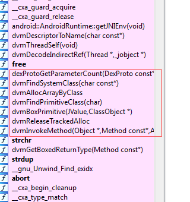      
这些函数跟dvm Method方法很有关，有点像java hook。      
3．分析On_load方法：      
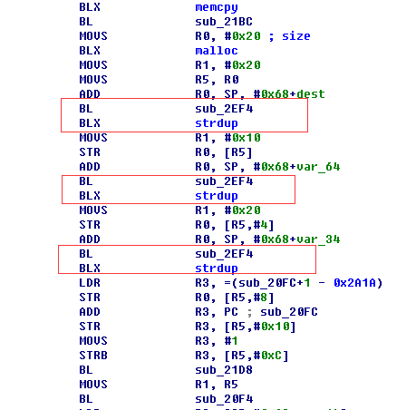      
Strdup是赋值字符串，可以肯定sub_2ef4是解密函数。先跳过具体算法，直接动态跟，发现其字符串是Mm、getString2和Ljava/langString;I      
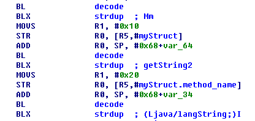      
到这里，已经基本可以确定是getString2方法被动了手脚。因为此方法本来是个java层方法，上面分析此方法调用native层的getkey方法。由于on_load方法还没有注册getkey方法，此时解密这些字符串是不可能去反射调用getString2。那么，其目的只有2中，要么动态篡改字节码，要么java hook。再结合导入了dvm函数，基本可以确定是java hook。另外，在这里发现一个操作+1：获取thumb函数地址！
      
SO已经导出了函数，所以这个函数不太可能是注册getkey方法的。      
4. 基本确定了是java hook，那么对照着java hook源码来大致分析，把这个坐实了。      
[http://bbs.pediy.com/showthread.php?t=186054&highlight=hook+java](http://bbs.pediy.com/showthread.php?t=186054&highlight=hook+java)      
[http://bbs.pediy.com/showthread.php?t=192803](http://bbs.pediy.com/showthread.php?t=192803)      
梁哥的java hook改进了代码，不需要调用register函数。      
从尾部来分析，跟进函数：      
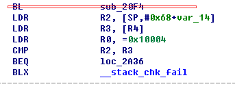      
在函数末尾查看关键点：      
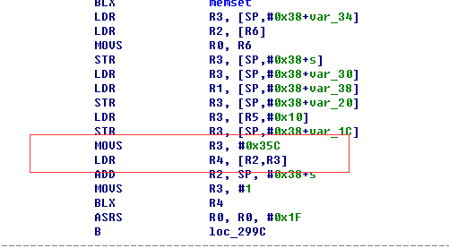      
标准(*env)->Register函数调用形式，可以确定是第一个帖子的形式。可以直接下载帖子的代码，从SO流程正向分析，这里就不赘述了。      
到这里，我们已经确定了getString2被hook后的native方法sub_20fc。      
5. 现在关注sub_20fc方法。在Java层验证是：      
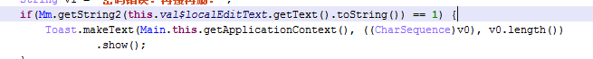      
找下这个方法返回1的地方：      
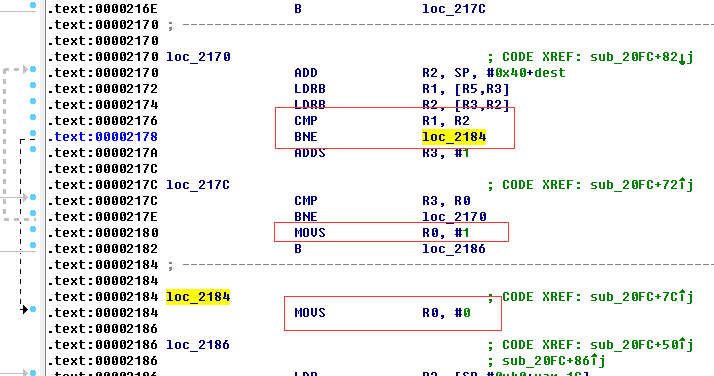      
可以确定这个循环是比较结果的地方。循环变量放在r3中，那么即是比较r5和r2中的值。      
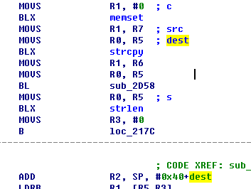      
而r2的值是从r7拷贝过来的，前面可以看到，      
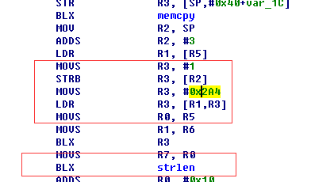      
R7的值是从getUtfchars从输入String中获取的，即是输入。那么没有必要关心sub_2d58函数做了什么解密操作，直接在2166下断点查看即可。      
而r5的值从      
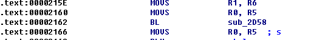      
如果跟进这个函数，熟悉aes流程的童鞋可以发现其实就是aes。      

##不择手段
###350

>不可说！

伪加密，修复下可以得到一个zip。      
zip解压后得到一个arm下的程序。      
看了半天，ida也分析了半天，得出结论。这货是go写的。      
不会也看不懂。        
然后在手机上运行了下。        
输出一串奇奇怪怪的东西。以为是报错，就也没理他。        
后来，把输出结果重定向到一个文件。        
之后winhex打开，发现，是一个class文件。       
jd-gui直接反编译。        
得到flag      

    import java.io.PrintStream;

    class CNSSAndroid
    {
      public static void main(String[] paramArrayOfString)
       {
        char[] arrayOfChar = { 'C', 'N', '5', '5', '_', 'A', 'R', 'M' };

        System.out.println(arrayOfChar);
      }
    }

>flag:CN55_ARM

##Find you there!
###350
>Find me?!

先接出来得到要输入:   
iscc\_2015\_have\_fun  
然后看到下面这句:  
x0r\_iscc2015\_f0r\_pe \_\_3kJoker  
写py异或处理  
rdata段为: 0x1200-0x1800  
居然是依次异或iscc2015中的每一位.  
J0ker又教了我一招,如何异或...  

    #!/usr/bin/env python
    # -*- coding: utf-8 -*-
    __Url__ = 'Http://www.purpleroc.com'
    __author__ = 'Tracy_梓朋'
    
    data = open("../../FILES/REVERSE/iscc2015.exe", "rb").read()
    key = "iscc2015"
    re_key = 0x00
    for i in range(len(key)):
        re_key ^= ord(key[i])

    result = []

    if __name__ == '__main__':
        for i in range(int(0x1200), int(0x1800)):
            result.append(chr(re_key ^ ord(data[i])))
        #print "".join(result)
        open("../../DATA/RE07.dat","wb").write("".join(result))
        print re.findall(r'flag:.*', "".join(result))[0]

>flag:{b9b7cacc4f0d7f5247195e4a5b8a1e19}

##JUMP
###400

>输入正确的超空间地址，勇敢的JUMP吧！

本题wp由ThomasKing提供。   
这道题比较有意思。   
Java层代码加载了一个jar文件，在raw文件可以看到这个dex包，打开即可看到一个fake的dodo函数，当然提交这个flag是不对的。   
发现一个Application类，里面加载了一个SO文件。这个一般是壳子要干的事情，查看Manifest.xml文件，并没有什么异常。看来这个SO干了很多事情。   
查看on_load函数，从尾部查看，找到老朋友：   
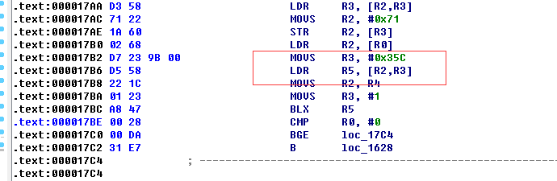
Register调用，查看java层代码，是c.e方法。   
查看on_load前面的代码，直观没发现什么东西。看看import函数：   
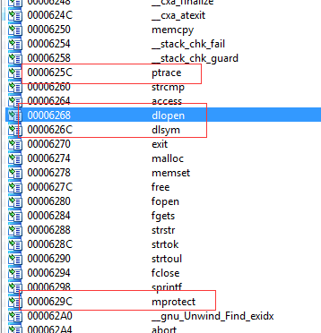
调用了几个关键函数，看来又要干什么了。   
找到ptrace调用点，发现其做了反调试TRACE_ME。Patch掉，便于动态调试。   
另外，发现on_load函数有一个特点：先调用memcpy，然后调用sub_1530函数。猜测是解密函数。   
好像没有什么东西了，动态跟跟。   
F8单步跟踪on_load函数，果然发现sub_1530是解密函数。逐步解密一下字符串：   

    /system/bin/qemu-props –> 检测模拟器
    libdvm.so
    dvm_dalvik_system_DexFile
    openDexFile
    com/iscc2015_42/ThisApp
    com/iscc2015_42/c
    ….

从libdvm.so查找这个dvm_dalvik_system_DexFile和openDexFile有点赤裸裸的加载Dex文件！查看Manifest api等级，高于4.0。加上之前fake那个Dex文件，有一种不祥的预感。   

现在有个问题很奇怪，为什么要自定义DexClassLoader？如果仅仅加载Dex文件，没有必要自定义。   
那我写一个Dex文件，在dodo方法中仅仅打印字符串，放入raw运行看看效果。结果，木有输出！   
看来猫腻就在自定义DexClassLoader了。   
仔细查看dd类，发现private int k;引起了我的注意。从后面的重写方法看到，以findclass为例子，在definClass时，把这个k值作为参数传入。这个参数应该传mCooike值，那k即为mCooike。   
而这个k值是通过c.e这个native方法获得，并且openDexFile仅仅返回加载Dex文件的mCookie值。。。   
查看c.e方法，有个数字有点儿意思：   
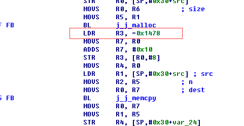   
0x1478，大概5K左右。看来是个文件。动态调试发现，果然是个Dex文件，dump出来，反编译找到真正的dodo方法。   
反推一下java代码，得到flag。   
貌似到这里就结果了，不过还有一个问题。仅仅为了搞个native加载Dex文件，也要不了这么多代码，也没必要搞个Application，似乎还有什么东西。   
再次查看on_load方法，发现一个函数：   
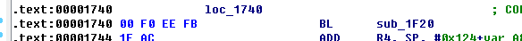   
这个函数调用了mprotect方法引起了我的注意。   
F8跟踪这个函数，发现解密了一些字符串：   
   
    /data/dalvik-cache/data@app@com.iscc2015_42-%d.apk@classes.d
    Lcom/iscc2015_42/ocl;
    ob
    a
    …
查看ocl类的ob和a方法，其声明完全相同！   
查看mmaps文件，mprotect改了odex文件的属性。估计修改了什么东西，dump出这个odex文件反编译，重点查看ob和a方法。   
对比原dex文件，发现a方法其实被改为了：   

    .param p1, "s"    # Ljava/lang/String;
    
        .prologue
        .line 112
        const/4 v1, 0x0
    
        .line 113
        .local v1, "r":Ljava/lang/String;
        if-eqz p1, :cond_0
    
        .line 114
        invoke-virtual {p1}, Ljava/lang/String;->length()I
    
        move-result v2 //函数结束了

再看看ob方法，发现这个段就是ob方法的smali代码。   
到这里，所有都明白了，原来是做了动态字节码篡改，修改了a方法。   

#PWN
##exp1
###350

>有一个参数可以使程序弹出计算器，找出这个参数并把它MD5值作为flag提交。

利用输入参数与‘dC’的异或值来控制覆盖长度，题中给出了通用jmp esp地址7ffa4512。      
所以，想办法让jmp esp覆盖ret地址即可。      
然后,发现,只要填充24个A就可以了,就知道要输入gd还是dg来着,拿着这个字符去md5一下就是flag.      

    echo dg > 1.dat && md5sum 1.dat | cut -b 1-32 && rm 1.dat

>flag is: a6be8a33b7c987f4ffb76d9c9805c7eb

##1day
###450

>IPS发现并捕获到了一个1day漏洞的利用，还好有防御措施，系统未被攻陷。请你帮danny后续分析一下这次漏洞利用的payload，分析并找到它的验证密钥。      

这个是个挺好玩的题目。      
给的是一段字符：      

    Ph0666TY1131Xh333311k13XjiV11Hc1ZXYf1TqIHf9kDqW02DqX0D1Hu3M15103
    l0y4q3J3d8O4F8K095N0O3L5k3W4p1L3m3O8m018M4T3l0E4V1K1M0m0L1K0z8L4
    O8N4s3A4Y5l1P0e5M4I8K3T3p3g3B0g8O8P3119120z3Y1p0G0n7p2m2t2Z1M034
    N4Y8M4A3N0R4U4u8O7O370e4p1o4B0X0c3E3c2p3s303M0f0x3F3R2r4Z3v8o0V0
    E7k0l0K2z2D190T123D4o7L4G5K2z0v4I3Z3R4B3J3c38175M313a5p3y3a4X114
    O394o4F3C3g4W184W343c4A2r0g3e05313M4n0l4V2w0l4J3R4Q3G153V4x4l0S0
    q2t0V0D4z3D3R020P3G3v163Y4z3a1p1N3E40113P304U1n0a3G3t193r304y0V3
    m0V300a8P5N8M3f3L4u3Y2D8M4r4P3g4I4u3B2E5o314N3b3O4r3V7p3z5K4B0U0
    I3E3p1M3n3D2t0x374U402n7N4X3q0b031p8M8M3P40364K4o8O0H2z0H3p3V054
    l3H2n2u4r3v2F7M4q4O7K2j2q2D2I2w324P4J19134A0b4K4U4W3c0G0T174I5O3
    U4u4t3o3g4H4q0G0r4Y3O0A4O0V4u2u4p4U1K2B4o3c3g0w5p0Y3R0u0O4R0S0d4
    Y7L5K0D2C7N2M3q3z7L320e4W0m2v8l5L4W3X8N0q7l2Z024B4P8L8K8L3g5L0T7
    L8L3v040h144k4x4P4t4v8O8M403r4M4p8L3L0E113p0A4n3L3f12124O361N4G4
    M4Q3t2n094C3D141M0E8K4B4S4Z0c3Y0Q023D0F4U4W1n0q333K1K2y4p335l5N0
    k0m153R0h2L370A3n7N330d4A0m5N1m083l08084V3C3D0w4Q1o4J8K060b8l054
    v3D0j144T5l0h3m8L7K2G4y0a4Q3A3j3X7L5n0b4n4V1N0t3Z3K0W4M3F2L2H4q1
    M0n340w0j4j3b194y8m3w0u1k0Y3J2F3b7O5M0U3f4W2v3c4F1k5M1o2q383R123
    23t0m144F7M365N2o2K3V0A4k5l1k3l3g7K5N0G0W15315M0p0l2k2k2E0I3V335
    O4S3U2o1P4H3V1L053s4s2m0a00360o3Y3X2Z4M1p5k0x0n4s4Y5M8L3q3b4A1M0
    43p3I1n3K4R4E0t3G3J1n4j4n4v325N4q4t4U0E4k3C5K4y0B3H0x174N5k1K0e4
    Q3N0L134Y5n0v404p2w2L0A4v3D4D7m4C3C5m193Z4W3S1O2M4C4E8N2j3C1L013
    74Q2E0N3o3D8N4q0d3u7p2o2q3D8L100p3J124n4s4T3u4E7N3D0R4Z3j3d4G4x8
    N5M3F117O3B0u3b3H4V4W4L4I8l4k7l2p0Q3l0B2x2r2v2Z0p8P164L3L2K2j0A0
    Z3L0k0N4M5n0a0k323H4E5m400V8l075o3p5M102j0m0n054B4Y4M093i4V353y3
    S4l360Y360Y5m8M0G0n1L0w3K2K5n5L8n4Q4U0E0e5l0K3N3Y2N3U0A3m2K4q0x0
    E0P3f4y2t4n18023e1M0Q0A8o4R3N3e3T5n3W5K0W4R3H1P373w7o388K2L138N7
    M4T0c0G0O4U4U103o3m374G8N3F3a0q2q8P3w170a5m3a0y5L0S4B0B0a4V4Z4C4
    L8L0w0A2C5n3X402J4P3C4E3i1n4v2v3c3I0x2J4S3x304y4s4u4V197K2s3K0u3
    u3A4A2z2B03
然后，一看就知道是alpha3处理过的字符数字shellcode。      
于是找出alpha3，生成了多生成了几个模板：      

    python ALPHA3.py x86 ascii mixedcase EAX --input=ALPHA3.cmd
    hffffk4diFkTpj02Tpk0T0AuEE150A0L0D2I1o2B2p0a0L2M0A11120l0B192p0D2z0L
    python ALPHA3.py x86 ascii mixedcase EBX --input=ALPHA3.cmd
    hffffk4diFkDsj02Dsk0D3AuEE150A0L0D2I1o2B2p0a0L2M0A11120l0B192p0D2z0L
    python ALPHA3.py x86 ascii mixedcase EcX --input=ALPHA3.cmd
    hffffk4diFkDqj02Dqk0D1AuEE150A0L0D2I1o2B2p0a0L2M0A11120l0B192p0D2z0L
    python ALPHA3.py x86 ascii mixedcase EDX --input=ALPHA3.cmd
    hffffk4diFkDrj02Drk0D2AuEE150A0L0D2I1o2B2p0a0L2M0A11120l0B192p0D2z0L
    python ALPHA3.py x86 ascii mixedcase EDI --input=ALPHA3.cmd
    hffffk4diFkDwj02Dwk0D7AuEE150A0L0D2I1o2B2p0a0L2M0A11120l0B192p0D2z0L
    python ALPHA3.py x86 ascii mixedcase ESI --input=ALPHA3.cmd
    VYhffffk4diFkDql02Dqm0D1CuEE150A0L0D2I1o2B2p0a0L2M0A11120l0B192p0D2z0L
    python ALPHA3.py x86 ascii mixedcase ESP --input=ALPHA3.cmd
    TYhffffk4diFkDql02Dqm0D1CuEE150A0L0D2I1o2B2p0a0L2M0A11120l0B192p0D2z0L
    python ALPHA3.py x86 ascii mixedcase EBP --input=ALPHA3.cmd
    hffffk4diFkDuj02Duk0D5AuEE150A0L0D2I1o2B2p0a0L2M0A11120l0B192p0D2z0L
    
    python ALPHA3.py x64 ascii mixedcase RAX --input=ALPHA3.cmd
    Ph0666TY1131Xh333311k13XjiV11Hc1ZXYf1TqIHf9kDqW02DqX0D1Hu3M2m0B2t0D2J1m2z2p0a0L2N0A13120T0B192p0D2z0L
    python ALPHA3.py x64 ascii mixedcase RBX --input=ALPHA3.cmd
    Sh0666TY1131Xh333311k13XjiV11Hc1ZXYf1TqIHf9kDqW02DqX0D1Hu3M2m0B2t0D2J1m2z2p0a0L2N0A13120T0B192p0D2z0L
    python ALPHA3.py x64 ascii mixedcase RCX --input=ALPHA3.cmd
    Qh0666TY1131Xh333311k13XjiV11Hc1ZXYf1TqIHf9kDqW02DqX0D1Hu3M2m0B2t0D2J1m2z2p0a0L2N0A13120T0B192p0D2z0L
    python ALPHA3.py x64 ascii mixedcase RDX --input=ALPHA3.cmd
    Rh0666TY1131Xh333311k13XjiV11Hc1ZXYf1TqIHf9kDqW02DqX0D1Hu3M2m0B2t0D2J1m2z2p0a0L2N0A13120T0B192p0D2z0L
    python ALPHA3.py x64 ascii mixedcase RSP --input=ALPHA3.cmd
    Th0666TY1131Xh333311k13XjiV11Hc1ZXYf1TqIHf9kDqW02DqX0D1Hu3M2m0B2t0D2J1m2z2p0a0L2N0A13120T0B192p0D2z0L
    python ALPHA3.py x64 ascii mixedcase RBP --input=ALPHA3.cmd
    Uh0666TY1131Xh333311k13XjiV11Hc1ZXYf1TqIHf9kDqW02DqX0D1Hu3M2m0B2t0D2J1m2z2p0a0L2N0A13120T0B192p0D2z0L

于是就能发现，给我们的那段，其实就是一个shellcode，运行条件还必须是RAX指向它，而且，是64位平台上运行的。      

so，知道了这些信息后，就得想办法让它运行起来。      
一般shellcode是在堆栈区的，而且呢，因为它是加密过的shellcode，直接静态分析显然是不可取的，而且在解密的过程中，它会写自身。      
那怎么办？首先只能动态调试了，其次，为了方便调试而不是每次都去改堆栈内容，改eip等，最好的办法就是，写个x64的程序，并设置code段为可写可读。      
最好是把地址随机化之类的防护全部关了。      

生成好程序之后，找到入口点，并从程序入口点开始用shellcode替换等长度的原本程序的内容。      
因为在运行shellcode前，rax必须指向shellcode，而且地址随机化已经关闭，所以，在shellcode前加入一句：
      
    mov rax,0x000000014000100a      
汇编后为：      

    pwn.asm("mov rax, 0x14000100a", arch='amd64')      
    'H\xb8\n\x10\x00@\x01\x00\x00\x00'      
占十个字节，所以，shellcode从0x000000014000100a开始的。再在shellcode后删除原本的code段10字节，保证程序大小不变，并且各区段位置不变。      
这样，就能够直接运行程序了，后来跟天意聊天的时候，发现tm自己当时sb了。
调试shellcode不应该直接：

    char code[] = "paste your shellcode here";
    
    int main(int argc, char **argv)
    {
    int (*func)();
    func = (int (*)()) code;
    (int)(*func)();
    }

只要在shellcode前加上两句汇编，比如：lea rax,code，就能够达到使rax指向shellcode，并且不用考虑可写的问题。      
在动态调试的过程中，发现，似乎shellcode做了反调试。到第一个获取基址的地方就过不去了。      
但是通过上面对shellcode的解码还是能看到不少信息。      
比如192.168.1.1，ws2_32.dll，Hi!，Done!，cngratulation等等。      
然后，猜测程序要访问192.168.1.1。      
于是在运行程序的同时，netstat -an | find "192.168.1.1"      
发现他尝试连接到192.168.1.1的4444端口。      
知道这些了，对我们来说已经非常不错了。      
把虚拟机的虚拟网卡设置为192.168.1.1，或者自身设置也行。      
然后：      
nc -l -p 4444 -vv      
再运行程序，发现能收到Hi!      
但是，还是无法理解程序。怎么办呢？      
这里用到第一个内存dump的思路。      
在windbg里，执行到00000001`4000112c e84a010000 call image00000001_40000000+0x127b时，把内存dump出来。      

    .writemem c:\dump.dmp 0000000140000000 0000000140010200
为什么是写这些呢？因为0000000140000000是mz，然后我dump和exe同样大小的内存。虽然dump出来的不会是一个能够运行的exe，但是对我们来说足够了。      
因为这次dump，其实也只是为了看一下解密后的代码。直接用任务管理器的dump，会出现一种情况，就是，数据量太多，不便分析。      

把dump出来的程序放到ida里，通过winhex等的合作，找到我们调试不下去的地方。      
然后静态分析，整个shellcode，功能段如下：      

    .text:0000000140001C8E                 lea     rdx, [rsp+30h]
    .text:0000000140001C93                 lea     ecx, [rax+68h]
    .text:0000000140001C96                 mov     dword ptr [rsp+50h], '_2sw'
    .text:0000000140001C9E                 mov     dword ptr [rsp+54h], 'd.23'
    .text:0000000140001CA6                 rep stosb
    .text:0000000140001CA8                 mov     ecx, 0FFFB8C06h
    .text:0000000140001CAD                 mov     word ptr [rsp+58h], 'll'
    .text:0000000140001CB4                 mov     byte ptr [rsp+5Ah], 0
    .text:0000000140001CB9                 mov     dword ptr [rsp+60h], '.291'
    .text:0000000140001CC1                 mov     dword ptr [rsp+64h], '.861'
    .text:0000000140001CC9                 mov     dword ptr [rsp+68h], '1.1'
    .text:0000000140001CD1                 mov     dword ptr [rbp+1B0h], '!iH'
    .text:0000000140001CDB                 mov     dword ptr [rbp+1B8h], 'enoD'
    .text:0000000140001CE5                 mov     word ptr [rbp+1BCh], '!'
    .text:0000000140001CEE                 mov     dword ptr [rsp+40h], 'rgnc'
    .text:0000000140001CF6                 mov     dword ptr [rsp+44h], 'luta'
    .text:0000000140001CFE                 mov     dword ptr [rsp+48h], 'oita'
    .text:0000000140001D06                 mov     word ptr [rsp+4Ch], 'n'
    .text:0000000140001D0D                 mov     dword ptr [rsp+30h], 'rgnc'
    .text:0000000140001D15                 mov     dword ptr [rsp+34h], 'luta'
    .text:0000000140001D1D                 mov     dword ptr [rsp+38h], 'oita'
    .text:0000000140001D25                 mov     word ptr [rsp+3Ch], 'n'
    .text:0000000140001D2C                 call    get_func_addr
    .text:0000000140001D31                 lea     rcx, [rsp+50h]  ; ws2_32.dll
    .text:0000000140001D36                 call    rax             ; loadlibrary()
    .text:0000000140001D38                 lea     rdx, [rsp+31h]
    .text:0000000140001D3D                 mov     ecx, 5C8A5B3Ah
    .text:0000000140001D42                 call    get_func_addr
    .text:0000000140001D47                 lea     rdx, [rsp+32h]
    .text:0000000140001D4C                 mov     ecx, 4011469352
    .text:0000000140001D51                 mov     r14, rax
    .text:0000000140001D54                 call    get_func_addr
    .text:0000000140001D59                 lea     rdx, [rbp-10h]
    .text:0000000140001D5D                 mov     ecx, 202h
    .text:0000000140001D62                 call    rax             ; 
    .text:0000000140001D64                 lea     rdx, [rsp+33h]
    .text:0000000140001D69                 mov     ecx, 725A5C1Fh
    .text:0000000140001D6E                 call    get_func_addr
    .text:0000000140001D73                 and     dword ptr [rsp+28h], 0
    .text:0000000140001D78                 and     dword ptr [rsp+20h], 0
    .text:0000000140001D7D                 xor     r9d, r9d
    .text:0000000140001D80                 xor     r8d, r8d
    .text:0000000140001D83                 lea     edx, [r9+1]
    .text:0000000140001D87                 lea     ebx, [rdx+1]
    .text:0000000140001D8A                 mov     ecx, ebx
    .text:0000000140001D8C                 call    rax             ; socket()
    .text:0000000140001D8E                 lea     rdx, [rsp+34h]
    .text:0000000140001D93                 mov     ecx, 61ADEF4h
    .text:0000000140001D98                 mov     rdi, rax        ; rdi = socket
    .text:0000000140001D9B                 call    get_func_addr
    .text:0000000140001DA0                 lea     rcx, [rsp+60h]  ; 192.168.1.1
    .text:0000000140001DA5                 mov     [rsp+70h], bx
    .text:0000000140001DAA                 call    rax             ; inet_addr()
    .text:0000000140001DAC                 lea     rdx, [rsp+35h]
    .text:0000000140001DB1                 mov     [rsp+74h], eax
    .text:0000000140001DB5                 mov     eax, 5C11h      ; 4444
    .text:0000000140001DBA                 mov     ecx, 5C9CA034h
    .text:0000000140001DBF                 mov     [rsp+72h], ax
    .text:0000000140001DC4                 call    get_func_addr
    .text:0000000140001DC9                 lea     rdx, [rsp+36h]
    .text:0000000140001DCE                 mov     ecx, 1ACF18D4h
    .text:0000000140001DD3                 mov     rsi, rax
    .text:0000000140001DD6                 call    get_func_addr
    .text:0000000140001DDB                 lea     r8d, [rbx+0Eh]  ; len
    .text:0000000140001DDF                 lea     rdx, [rsp+70h]  ; addr
    .text:0000000140001DE4                 mov     rcx, rdi        ; socket
    .text:0000000140001DE7                 call    rax             ; connect()
    .text:0000000140001DE9                 cmp     eax, 0FFFFFFFFh
    .text:0000000140001DEC                 jz      short loc_140001E61
    .text:0000000140001DEE                 lea     rdx, [rsp+37h]
    .text:0000000140001DF3                 mov     ecx, 6E826829h
    .text:0000000140001DF8                 call    get_func_addr
    .text:0000000140001DFD                 xor     r9d, r9d        ; 0
    .text:0000000140001E00                 lea     rdx, [rbp+1B0h] ; buf = Hi!
    .text:0000000140001E07                 lea     r8d, [r9+4]     ; len = 4
    .text:0000000140001E0B                 mov     rcx, rdi        ; socket
    .text:0000000140001E0E                 mov     rbx, rax
    .text:0000000140001E11                 call    rsi             ; send()
    .text:0000000140001E13                 xor     r9d, r9d        ; 0
    .text:0000000140001E16                 lea     rdx, [rsp+40h]  ; buf = 12fcb0
    .text:0000000140001E1B                 lea     r8d, [r9+14]    ; len = 14
    .text:0000000140001E1F                 mov     rcx, rdi        ; socket
    .text:0000000140001E22                 call    r14             ; Recv()
    .text:0000000140001E25                 cmp     eax, 0FFFFFFFFh ; No Error!
    .text:0000000140001E28                 jz      short exit      ; socket
    .text:0000000140001E2A                 cmp     byte ptr [rsp+30h], 0
    .text:0000000140001E2F                 jz      short loc_140001E49
    .text:0000000140001E31                 xor     edx, edx        ; rdx=0
    .text:0000000140001E33
    .text:0000000140001E33 loc_140001E33:                          ; CODE XREF: .text:0000000140001E47j
    .text:0000000140001E33                 mov     cl, [rsp+rdx+30h] ; cngratulation
    .text:0000000140001E37                 mov     al, [rsp+rdx+40h]
    .text:0000000140001E3B                 inc     rdx
    .text:0000000140001E3E                 cmp     cl, al
    .text:0000000140001E40                 jnz     short exit      ; socket
    .text:0000000140001E42                 cmp     byte ptr [rsp+rdx+30h], 0
    .text:0000000140001E47                 jnz     short loc_140001E33 ; cngratulation
    .text:0000000140001E49
    .text:0000000140001E49 loc_140001E49:                          ; CODE XREF: .text:0000000140001E2Fj
    .text:0000000140001E49                 xor     r9d, r9d
    .text:0000000140001E4C                 lea     rdx, [rbp+1B8h] ; Done!
    .text:0000000140001E53                 mov     rcx, rdi        ; socket
    .text:0000000140001E56                 lea     r8d, [r9+6]     ; len = 6
    .text:0000000140001E5A                 call    rsi             ; Send()
    .text:0000000140001E5C
    .text:0000000140001E5C ; =============== S U B R O U T I N E =======================================
    .text:0000000140001E5C
    .text:0000000140001E5C ; socket
    .text:0000000140001E5C ; Attributes: noreturn
    .text:0000000140001E5C
    .text:0000000140001E5C ; void __cdecl exit(int Code)
    .text:0000000140001E5C exit            proc near               ; CODE XREF: .text:0000000140001E28j
    .text:0000000140001E5C                                         ; .text:0000000140001E40j
    .text:0000000140001E5C
    .text:0000000140001E5C arg_288         = byte ptr  290h
    .text:0000000140001E5C
    .text:0000000140001E5C                 mov     rcx, rdi
    .text:0000000140001E5F ; 5:   v1();
    .text:0000000140001E5F                 call    rbx             ; close()
    .text:0000000140001E61
    .text:0000000140001E61 loc_140001E61:                          ; CODE XREF: .text:0000000140001DECj
    .text:0000000140001E61                 lea     r11, [rsp+arg_288]
    .text:0000000140001E69                 mov     rbx, [r11+30h]
    .text:0000000140001E6D                 mov     rsi, [r11+38h]
    .text:0000000140001E71                 mov     rsp, r11
    .text:0000000140001E74                 pop     r14
    .text:0000000140001E78                 retn

然后，问题来了，首先我们可以清除的知道，最后是对比[rsp+40h]与[rsp+30h]，而这两段在刚开始赋值的时候都是"cngratulation"。      
然后[rsp+40h]中的内容是recv过来的。那，关键的问题是[rsp+30h]中的值是否发生过改变？如果是，在哪发生的改变。      
看了半天，似乎，也没其他地方改了它，倒是每次都会传入到get_func_addr()中。get_func_addr()接收两个参数，第一个参数放到rcx，第二个放到rdx。      
我们发现，程序每次调用时都传入了[rsp+30h]-[rsp+3Eh]之间的地址。      
那，跟进函数get_func_addr(a1, a2)：      
    
      *(_BYTE *)a2 = *(_BYTE *)v18;
      *(_DWORD *)(a2 + 1) = 'SlO2';
      *(_BYTE *)(a2 + 5) = 0;

的确有赋值过程。      
问题又来了，怎么找到最后的值。首先我们不可能跟着他去算。      
两种方法吧，第一个是还原出c代码，跟着算一遍。      
第二个就是我用的方法。      
这是第二次dump内存，因为当时想的是，在程序等待recv()的过程中，他的确是执行完了所有的get_func_addr()。      
此时内存中应该计算好了[rsp+30h]中的值。而且，这个时候，我们并没有输入值，[rsp+40h]中存放的"cngratulation"。将不会被改变。      
如果此时dump内存搜索"cngratulation"，就可以直接把要输入的密钥找出来。      
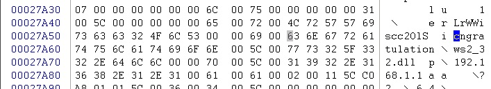

最后得到
>Flag:LrWWiscc2OlS      
